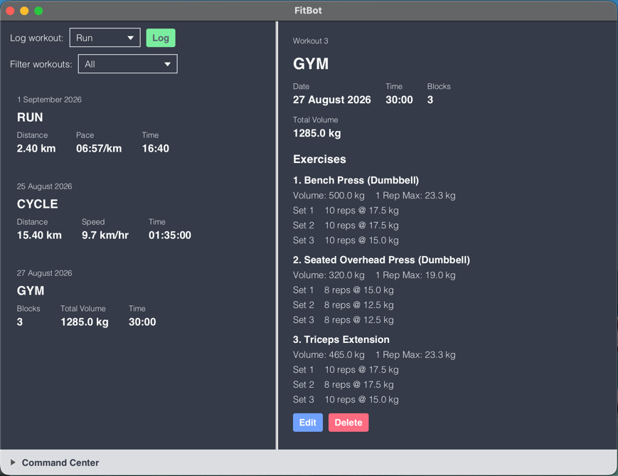

# FitBot

FitBot is a JavaFX desktop fitness tracker for recording and reviewing running, cycling, and gym workouts. It provides a graphical interface with a command panel, automatic local persistence, calculated workout metrics, and commands for managing stored workouts.

## Features

- Log run, cycle, and gym workouts.
- View workout summaries and detailed metrics.
- Calculate running pace, cycling speed, gym volume, and estimated one-repetition maximums.
- Find workouts by their displayed list number.
- Filter workouts by type.
- Edit or delete existing workouts.
- Use command-specific help with `help <command>`.
- Save data automatically to `data/workouts.json`.

## Installation

1. Ensure that **Java 25 or later** is installed on your computer. 
   **Mac users:** Make sure you install the exact JDK version specified [here](https://se-education.org/guides/tutorials/javaInstallationMac.html).
2. Download the latest `.jar` release from the [releases page](https://github.com/teleifo/CS3227-2610-mp1/releases).
3. Copy the downloaded `.jar` file to the folder you want to use as the application's home directory.
4. Open a command terminal and navigate to that folder using `cd`.
5. Run the following command to start the application: `java -jar fitbot.jar`.

## Project documentation

- [User Guide](docs/UserGuide.md): installation, commands, and usage examples.
- [Developer Guide](docs/DeveloperGuide.md): architecture, design decisions, development process, and release process.
- [Reflections](docs/Reflections.md): reflections on AI-assisted software engineering.
